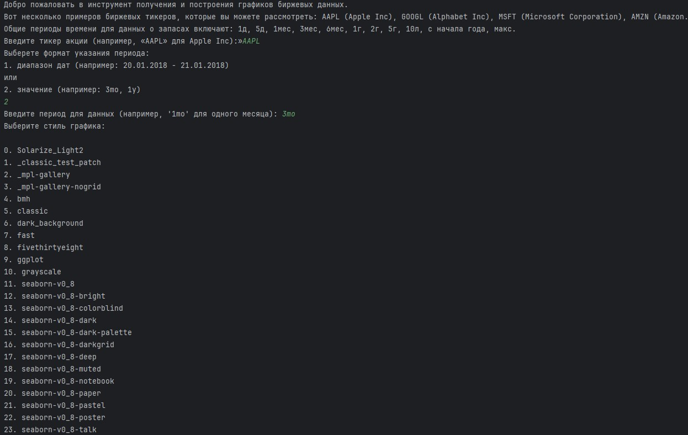

# Описание
Программа для получения данных о ценах на акции и отображения графиков с такими показателями, как RSI, MACD, среднее значение цены закрытия.

# Примеры работы
.1 Гистограмма среднего значения цены закрытия  

.2 Консольное меню  

.3 Пример графиков  

